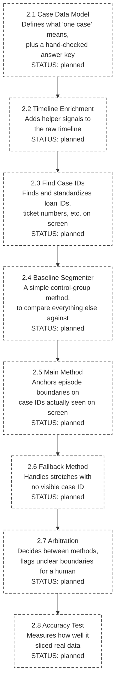
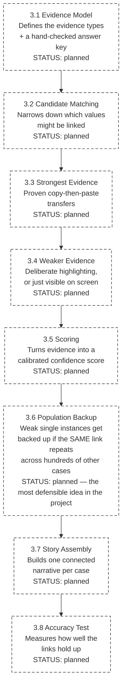
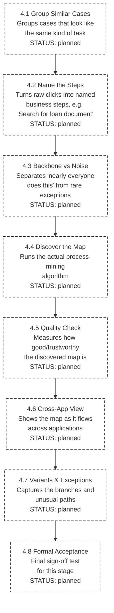
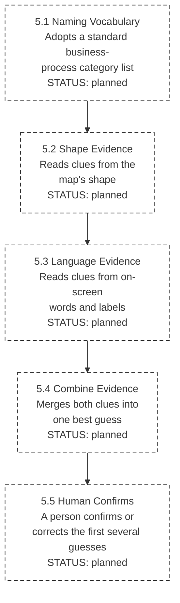
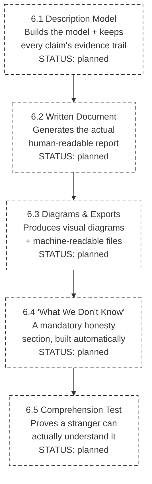
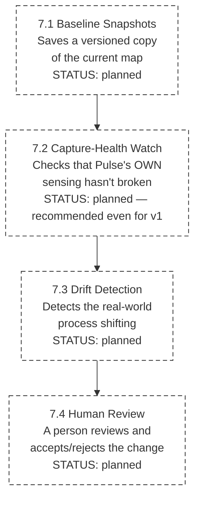

# Pulse — Flow Chart Presentation

*Built for talking through with a manager/business audience. Boxes are left uncolored on purpose — add your own colors (each Mermaid box has a `class` you can restyle). Solid-border style = built and tested with real numbers. Dashed-border style = designed, not built yet.*

---

## 1. The Big Picture — Seven Stages

**One line on the whole thing:** raw activity goes in on the left, a finished, trustworthy process document comes out on the right.

```mermaid
flowchart LR
    S1["STAGE 1<br/>Watching<br/>-----------<br/>Records every click, app switch,<br/>and window change<br/>-----------<br/>OUTPUT: a timeline of raw events"]
    S2["STAGE 2<br/>Case Boundaries<br/>-----------<br/>Cuts the endless recording into<br/>individual cases<br/>-----------<br/>OUTPUT: a list of separate cases"]
    S3["STAGE 3<br/>Connecting Apps<br/>-----------<br/>Proves how information moved<br/>between different systems<br/>-----------<br/>OUTPUT: one connected story per case"]
    S4["STAGE 4<br/>Finding the Pattern<br/>-----------<br/>Finds the real process common<br/>to hundreds of cases<br/>-----------<br/>OUTPUT: one process map"]
    S5["STAGE 5<br/>Naming the Process<br/>-----------<br/>Labels what kind of process it is<br/>-----------<br/>OUTPUT: a category label + confidence"]
    S6["STAGE 6<br/>Final Report<br/>-----------<br/>Packages everything into one<br/>readable document<br/>-----------<br/>OUTPUT: the process document"]
    S7["STAGE 7 optional<br/>Staying Current<br/>-----------<br/>Watches for the real process<br/>quietly changing later<br/>-----------<br/>OUTPUT: a change alert for a human"]

    S1 --> S2 --> S3 --> S4 --> S5 --> S6 --> S7

    classDef built fill:#ffffff,stroke:#222222,stroke-width:3px;
    classDef planned fill:#ffffff,stroke:#222222,stroke-width:1px,stroke-dasharray: 6 4;
    class S1 built
    class S2,S3,S4,S5,S6,S7 planned
```

**Where we actually are on this chart today:** only the first **two of ten phases inside Stage 1** are done (see below) — so on this 7-box picture, we are still *inside box 1*, not past it yet. Everything from the middle of Stage 1 onward is designed but not built.

---

## 2. Stage 1 — Watching (capture)

**One line — what happens:** Pulse quietly records what you clicked, which app/window you were in, and what you copied — across every application, all the time.
**One line — how the output is shown:** a plain time-ordered table (what we demoed): time, app, window, action. Not a video, not raw database bytes.

```mermaid
flowchart TD
    P1["1.1 Event Schema and Store<br/>Defines what one recorded<br/>event looks like, saves it safely<br/>STATUS: BUILT and TESTED"]
    P2["1.2 Desktop Capture<br/>Watches clicks, app switches,<br/>window open/close<br/>STATUS: BUILT and TESTED"]
    P3["1.3 Read On-Screen Text<br/>Reads the actual words/values<br/>visible on screen, not just 'a click happened'<br/>STATUS: planned — next up"]
    P4["1.4 Highlight Capture<br/>Records when someone<br/>highlights/selects text as its own signal<br/>STATUS: planned"]
    P5["1.5 Copy/Paste Capture<br/>Links a copy in one app<br/>to a paste in another<br/>STATUS: planned"]
    P6["1.6 Browser Capture<br/>Same watching, inside<br/>Chrome/Edge tabs<br/>STATUS: planned"]
    P7["1.7 One Merged Timeline<br/>Combines every source into<br/>one correctly-ordered record<br/>STATUS: planned"]
    P8["1.8 Privacy Rules<br/>Hashes sensitive IDs like loan numbers;<br/>keeps labels/titles readable<br/>STATUS: planned"]
    P9["1.9 Full Acceptance Test<br/>Proves it all works together<br/>across several real apps<br/>STATUS: planned"]
    P10["1.10 Fallback for Old Screens<br/>Computer-vision reading for<br/>mainframe / Citrix screens<br/>STATUS: planned — cannot be tested until inside the bank"]

    P1 --> P2 --> P3 --> P4 --> P5 --> P6 --> P7 --> P8 --> P9 --> P10

    classDef built fill:#ffffff,stroke:#222222,stroke-width:3px;
    classDef planned fill:#ffffff,stroke:#222222,stroke-width:1px,stroke-dasharray: 6 4;
    class P1,P2 built
    class P3,P4,P5,P6,P7,P8,P9,P10 planned
```

**Real numbers behind the two "built and tested" boxes:** 10,000/10,000 events written and read back correctly; 20/20 broken records correctly rejected; 5/5 hard-kill tests recovered with no damage; ~3,290 events/sec (needed ≥2,000); 4 live test runs each with 100% of app switches captured, 100% correctly attributed to the right app, and zero keystrokes ever recorded.

---

## 3. Stage 2 — Finding Where One Case Starts and Ends

**One line — what happens:** Slices the nonstop recording into individual, separate cases (e.g. "this is one loan review, start to finish").
**One line — how the output is shown:** a list of episodes, each with a start time, end time, and the case identifier it was anchored on.

---

## 4. Stage 3 — Connecting the Dots Across Applications

**One line — what happens:** Proves *how* a value (like a loan ID) actually moved from one application to another during a case — using real evidence, ranked from strongest (a proven copy/paste) to weakest (just visible around the same time).
**One line — how the output is shown:** one connected story per case: "opened App A, saw loan ID, opened App B, searched using that same loan ID" — with each link labeled by how sure we are.

---

## 5. Stage 4 — Finding the Real Process Across Many Cases

**One line — what happens:** Looks across hundreds of individual cases and finds the pattern that actually holds up — the backbone steps everyone does, the optional branches, and the rare one-off mistakes.
**One line — how the output is shown:** one process map/diagram showing the steps in order, including where it branches.

---

## 6. Stage 5 — Naming What Kind of Process It Is

**One line — what happens:** Looks at the shape of the process map plus the actual words on screen ("Approve," "Reviewer Comments") and proposes what type of process this is.
**One line — how the output is shown:** a label like "QA/QC review," with the evidence behind the guess, confirmed or corrected by a human the first several times.

---

## 7. Stage 6 — Producing the Final Output

**One line — what happens:** Packages everything learned into one clear written document — this is the actual deliverable the whole project exists to produce.
**One line — how the output is shown:** a structured report: steps in order, how apps connect, branches/exceptions, the process type, plus diagrams, and an honest "what we don't know" section.

---

## 8. Stage 7 — Keeping It Current (optional for v1)

**One line — what happens:** Because Pulse never stops watching, it can notice later if the real process quietly changed, instead of the document silently going stale.
**One line — how the output is shown:** an alert to a human — "this process may have changed" — with a diff, never a silent auto-update.

---

## How to use this for your presentation

- Each stage's Mermaid box block has a `classDef` at the bottom — that's where you set colors (e.g. `classDef built fill:#c6f6c5,...` for green). Change the hex codes, nothing else needs to change.
- Solid border = built & tested. Dashed border = designed, not built. That's the honest state right now — most of the chart is still dashed.
- If your viewer doesn't render Mermaid automatically (GitHub and VS Code with the Mermaid preview extension both do), export each diagram as an image first and paste those into your slide deck.
